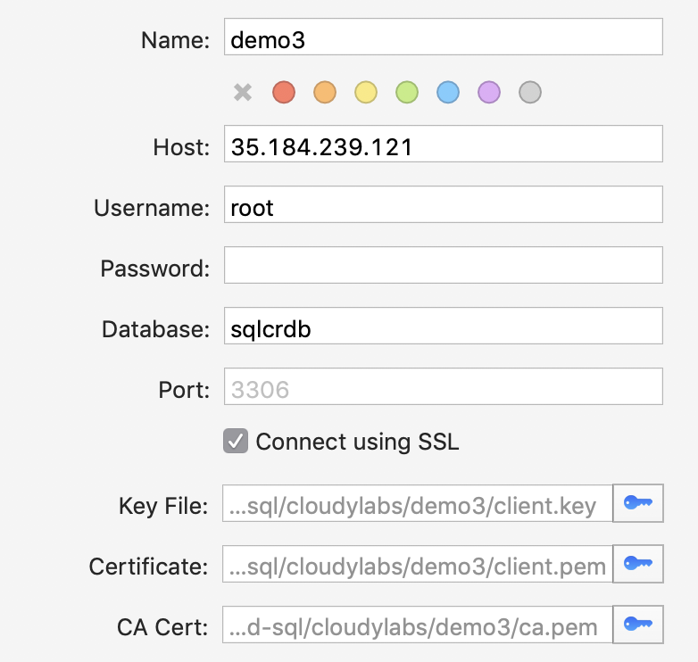

# cloud-sql-for-cloud-run-example

The current Cloud SQL integration in Cloud Run is not yet 100% idiomatic. Following current Cloud Run documentation for Cloud SQL you will be asked to perform some GCP-specific steps. This sample outlines a process of setting up Cloud SQL instance with secure (TLS) access that will work the same way from developer workstation as well as from within Cloud Run.

> Note, to keep this readme short, I will be asking you to execute scripts rather than listing here complete commands. You should really review each one of these scripts for content, and, to understand the individual commands so you can use them in the future.

## Pre-requirements

### GCP Project and gcloud SDK

If you don't have one already, start by creating new project and configuring [Google Cloud SDK](https://cloud.google.com/sdk/docs/). Similarly, if you have not done so already, you will have [set up Cloud Run](https://cloud.google.com/run/docs/setup).

## Setup

To setup this service you will need to clone this repo:

```shell
git clone https://github.com/mchmarny/logo-identifier.git
```

And navigate into that directory:

```shell
cd logo-identifier
```

## Cloud SQL

### Passwords

The [bin/password](bin/password) script will generate root and app user passwords and saved them in a project scoped path under `.cloud-sql` folder in your home directory.

```shell
bin/password
```

### Instance

The [bin/instance](bin/instance) will:

* Set up Cloud SQL instance and set default (root) user credentials
* Create MySQL database in the new Cloud SQL instance
* Configure Application database user and credentials
* Create and download Client SSL certificates

> Note, the created instance will be exposed to the world but allow only SSL connections. That means that even if someone obtained the root user password, they won't be able to connect to the databases without the client certificates

```shell
bin/instance
```

### Schema

The [bin/schema](bin/schema) script connects to the newly created Cloud SQL instance and applies database schema located in [sql/schema.ddl](sql/schema.ddl).

```shell
bin/schema
```

> This script checks for existence of the objects before creating them so you can run it multiple times. THis is also how you would apply schema changes.

### Environment Config

The [bin/env](bin/env) script creates `.my.cnf` file in your home directory with SSL configuration (certificates and key paths) to aid in future connections.

```shell
bin/env
```

At this point you should be able to connect to the newly created database with this command:

```shell
bin/connect
```

Alternatively, you can configure your client with a secure database connection:



> To find out the exact paths to your TLS certificates, run `more ~/.my.cnf`

### Certificates

Create KMS keys, encrypt Cloud SQL certificates, and save them to a GCS bucket

```shell
bin/secret
```

## Cloud Run

Once the Cloud SQL instance is configured, you can now deploy the Cloud Run service. First though, you will have to build the image and create a specific service account under which the new service will run.

### Container Image

Build container image using the [bin/image](bin/image) script

```shell
bin/image
```

### Service Account

Create a service account and assign it the necessary roles using the [bin/user](bin/user) script

```shell
bin/user
```

### Service Deployment

Once the container image and service account is ready, you can deploy the new service using [bin/service](bin/service) script

```shell
bin/service
```

## Test

At this point you should be able to access your deployed service. Note, there is currently no way tp predict the service URL, specifically the bit between the service name (`cloudsql-demo`) and the static Cloud Run domain (`uc.a.run.app`). To get info about the deployed service and backing Cloud SQL database run:

```shell
bin/info
```

Now, navigate in browser to the service URL which will return a JSON response.

```json
{
    "request_id":  "1224d739-cfa5-4500-9a8e-97df6a583aee",
    "request_on":  "2019-08-19 21:14:58.565436028 +0000 UTC",
    "cert_bucket": "project-cloudsql-demo",
    "db_conn_str": "root@tcp(104.154.161.x)/sqlcrdb?parseTime=true",
    "key_ring":    "projects/project/locations/global/keyRings/cloudsql-demo",
    "info":        "Success - records saved: 1"
}
```

If for some reason there were errors while inviting the service, the response will include the error details in the `info` field.


## Disclaimer

This is my personal project and it does not represent my employer. I take no responsibility for issues caused by this code. I do my best to ensure that everything works, but if something goes wrong, my apologies is all you will get.
