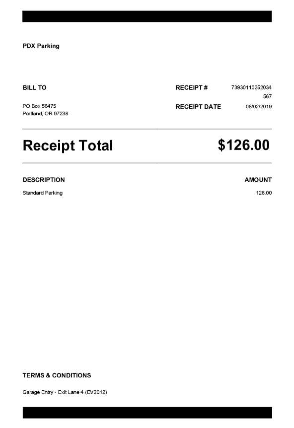

# name

## Cloud SQL

### Passwords

The [bin/password](bin/password) script will generate root and app user passwords and saved them in a project scoped `.cloud-sql` folder in your home directory.

```shell
bin/password
```

### Instance

The [bin/instance](bin/instance) will create:

* Cloud SQL instance and set root user credentials
* MySQL database in the new instance
* Application database user and credentials
* Client SSL certificates

> Note, the created instance will be exposed to the world but allow only SSL connections. That means that even if someone obtained the root user password, they won't be able to connect to the databases without the client certificates

```shell
bin/instance
```

### Schema

The [bin/schema](bin/schema) script connects to the newly created Cloud SQL instance and applies database schema located in [sql/schema.ddl](sql/schema.ddl).

```shell
bin/schema
```

> This script checks for existence of the objects before creating them so you can run it multiple times. THis is also how you would apply schema changes.

### Environment Config

The [bin/env](bin/env) script creates `.my.cnf` file in your home directory with SSL configuration (certificates and key paths) to aid in future connections.

```shell
bin/env
```



## Cloud Run

### Container Image


```shell
bin/image
```

### Service Account

```shell
bin/user
```

### Service Deployment

```shell
bin/service
```


## Disclaimer

This is my personal project and it does not represent my employer. I take no responsibility for issues caused by this code. I do my best to ensure that everything works, but if something goes wrong, my apologies is all you will get.
